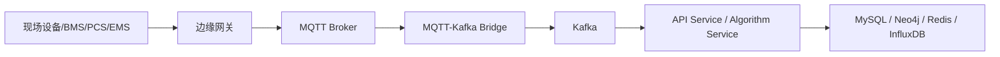

# 客户真实设备接入规范

> 目标：把客户现场的 BMS / PCS / EMS / 采集网关 数据稳定接入平台。

## 1. 推荐接入架构



建议原则：

- 设备不要直连云端业务接口
- 现场先做协议转换、限流、缓存和断点续传
- 云端只接收统一后的标准遥测

## 2. 接入方式

### 2.1 常见协议

- Modbus TCP / RTU
- CAN / CANopen
- OPC UA
- IEC 104
- 厂商私有 TCP / UDP 协议
- MQTT 直连上报

### 2.2 适配顺序

1. 解析客户现有协议
2. 映射到平台统一点表
3. 在边缘网关做协议归一
4. 通过 MQTT 上报
5. 由桥接服务写入 Kafka
6. 后端落 InfluxDB / Redis / MySQL / Neo4j

## 3. 统一数据模型

建议遥测统一为：

```json
{
  "tenant_id": "cust-a",
  "station_id": "station-001",
  "energy_unit_id": "eu-01",
  "cluster_id": "cluster-04",
  "cell_id": "cell-04-12",
  "ts": "2026-05-12T10:00:00+08:00",
  "metrics": {
    "voltage": 3.21,
    "current": 52.4,
    "temperature": 28.6,
    "soc": 82.1,
    "soh": 94.8
  },
  "quality": {
    "valid": true,
    "source": "gw-01",
    "seq": 9912
  }
}
```

## 4. Topic 规范

建议：

- MQTT: `battery/{station_id}/{energy_unit_id}/{cluster_id}/{cell_id}`
- Kafka 原始数据: `bms-raw-data`
- Kafka 告警: `alarm`
- Kafka 算法结果: `algorithm-result`

现有 mock 也建议跟这套规则对齐，避免联调时再改 topic。

## 5. 点表模板

每个测点至少要有这些字段：

| 字段 | 说明 |
|---|---|
| tenant_id | 客户/租户标识 |
| station_id | 站点 ID |
| energy_unit_id | 储能单元 ID |
| cluster_id | 电池簇 ID |
| cell_id | 单体 ID |
| point_code | 测点编码 |
| point_name | 测点名称 |
| protocol | 协议类型 |
| address | 寄存器/地址 |
| data_type | voltage/current/temperature/soc 等 |
| unit | 单位 |
| scale | 倍率 |
| endian | 字节序 |
| enabled | 是否启用 |

## 6. 数据质量要求

- 时间戳必须统一到毫秒级或秒级
- 序号要单调递增，便于去重
- 异常值要保留原始值和质量标识
- 断线重连后要补报缺口
- 采样频率要在点表中明确

## 7. 联调步骤

1. 先导入站点和点表主数据
2. 配置边缘网关协议解析
3. 接收一条样例遥测并人工核对
4. 连续跑 24 小时，看丢包、乱序、延迟
5. 对账 InfluxDB 和设备侧历史数据
6. 再打开告警和算法回写

## 8. 验收项

- 遥测能稳定入库
- 拓扑树和点表一致
- 告警触发准确
- 算法输入输出可追溯
- 断网恢复后可补数
- 数据格式升级不破坏旧设备

## 9. 需要客户提供

- 设备厂家和型号
- 协议文档
- 点表导出
- 采样周期
- 现场网络拓扑
- 站点/单元/簇/单体命名规则
- 允许开放的端口和白名单
- 是否允许双向控制

