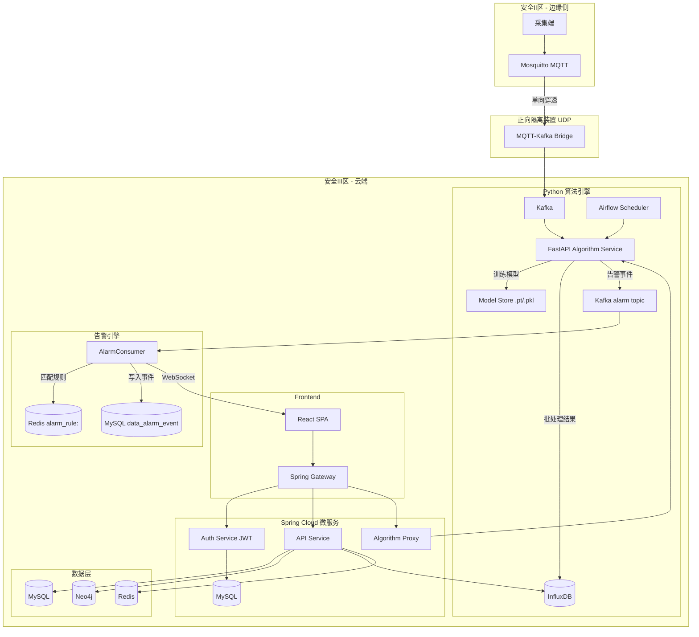

## 产品概述

面向电化学储能电站（磷酸铁锂）的全生命周期电池健康管理 SaaS 平台。通过采集电池侧时序数据（经 MQTT→Kafka 链路），利用六大算法模块诊断起火风险（微短路/析锂）、评估健康度衰减（SOH），触发告警引擎，并自动生成运维调换指导方案。

## 核心功能

- **电池驾驶舱（Dashboard）**：3x2 卡片网格概览 + Three.js 电池舱热点图模型 + 实时工况监测（运行对比曲线 + 温度热点图）
- **电池问诊室（Clinic）**：多维健康评估列表、单体下钻分析（三 Y 轴混排折线图）、容量分析、里程分析、安全评估（风险排序+低风险隐藏）、效率分析
- **运维沙盘（OM Simulation）**：防抖表单输入参数 + MILP 优化测算 + 调换指令映射表 + PDF 导出
- **告警中心（Alarm Center）**：告警事件列表、告警规则管理、实时告警通知、告警确认与处置
- **基础数据管理**：设备台账管理（含 PCS/变压器附属设备）、量测映射配置（Analog）、RBAC 权限管理
- **认证鉴权**：JWT 登录认证、权限拦截器、菜单动态渲染
- **六大算法引擎**：SOH 评估与寿命预测（Transformer-LSTM+PINN，离线GPU批处理）、微短路检测（Pseudo-OCV+RLMQD，Kafka流处理+Redis阈值缓存）、析锂检测（ICA/DVA+FPCA+Isolation Forest，Airflow每日批处理）、DCIR 估算（ECM+RLS，边云协同）、一致性评分（DBSCAN+SOM，周期性批处理）、运维调换优化（MILP+鲸鱼优化，弹性算力）
- **深浅双色主题**：企业级质感，语义色告警（红/黄/绿），全局数据更新时间组件
- **网络隔离与信创适配**：安全 II/III 区隔离、兼容国产数据库与统信 UOS
- **Mock 数据模拟器**：开发阶段生成电池侧模拟时序数据、拓扑关系、告警事件

## 技术栈选型

严格遵循 PRD 定义的技术选型：

- **Frontend**: React 18+ / React-Router v6 / Redux Toolkit / Tailwind CSS / Ant Design 5.x / ECharts（非 recharts，以 PRD 为准）/ Three.js
- **Backend**: Spring Boot 3.x / Spring Cloud / Spring Gateway / RESTful API / Java 17
- **Algorithm**: Python 3.9+ (Pandas, NumPy, PySpark, Scikit-learn, PyTorch, SciPy, MiniSom, PuLP/OR-Tools, FastAPI, Uvicorn)
- **时序数据库**: InfluxDB 2.x（含 measurement tag/field 定义、retention policy、continuous query 降采样）
- **图数据库**: Neo4j 5.x（Spring Data Neo4j 独立配置）
- **关系数据库**: MySQL 8.x（兼容达梦/人大金仓方言，JPA 方言抽象层）
- **缓存**: Redis 7.x（含 rt_measure:/ledger_cache:/alarm_rule:/analog_map: 四前缀数据结构定义）
- **消息队列**: Kafka + Mosquitto (MQTT)（含 MQTT→Kafka 桥接）
- **调度**: Airflow（算法定时批处理）
- **容器化**: Docker Compose

## 实现策略

采用 **三端分离、边云协同、数据驱动** 的架构模式：

1. **前端 SPA**：React 应用，通过 Spring Gateway 统一代理调用后端 API，Redux Toolkit 管理全局状态，ECharts 渲染数据图表，Three.js 渲染电池舱 3D 模型
2. **后端微服务**：Spring Boot 微服务集群，提供 RESTful API，通过 Spring Gateway 路由，各数据源独立配置（MySQL JPA / Neo4j Spring Data Neo4j / InfluxDB Java Client / Redis Spring Data Redis），集成 JWT 鉴权与告警引擎
3. **算法引擎**：独立 Python FastAPI 服务，支持 HTTP 触发 + Kafka 消费双模式，Airflow 定时调度批处理，训练/推理分离（模型 .pt/.pkl 持久化 + 版本目录），结果回写 InfluxDB/MySQL
4. **边云协同**：电池侧数据经 MQTT→Kafka 桥接上报，边缘网关捕捉电流阶跃切片上传云端 RLS 计算，安全 II/III 区 UDP 单向隔离

### 关键技术决策

- **前后端分离**：前端通过 Nginx 静态托管 + API 反向代理，开发阶段使用 Vite proxy
- **多数据源独立配置（修正）**：MySQL 使用 Spring Data JPA + AbstractRoutingDataSource（仅多关系型切换），Neo4j 使用 Spring Data Neo4j 独立 SessionFactory，InfluxDB 使用 InfluxDB Java Client 独立 Bean，Redis 使用 Spring Data Redis。禁止将 AbstractRoutingDataSource 用于非关系型数据源
- **JWT 鉴权体系**：Spring Security + JWT Token，Gateway 全局过滤器校验，API Service 方法级 @PreAuthorize，菜单基于用户角色动态渲染。**Gateway 认证白名单**：`/api/v1/auth/login`、`/api/v1/auth/refresh`、`/actuator/health` 免校验，其他请求必须携带有效 JWT
- **告警引擎**：算法输出（微短路标志位/析锂异常得分）→ Kafka alarm topic → Spring Boot AlarmConsumer → 匹配 AlarmRule（Redis alarm_rule: 缓存）→ 写入 data_alarm_event（MySQL）→ WebSocket 推送前端
- **MQTT→Kafka 桥接**：Mosquitto Broker 接收采集端 MQTT 上报，Python mqtt_kafka_bridge 消费 MQTT 转发至 Kafka 对应 topic，实现安全 II/III 区数据穿透
- **InfluxDB 时序分层**：原始数据 retention=30d，5分钟聚合 retention=90d，15分钟聚合 retention=180d，1天聚合 retention=3y；通过 InfluxDB Task（原 continuous query）自动降采样
- **算法训练/推理分离**：训练产出模型文件存 algorithm/models/trained/{module}/{version}/，推理 API 加载最新版本模型，训练通过 Airflow DAG 或 HTTP 触发
- **主题系统**：Tailwind dark: 类 + Ant Design theme.algorithm 双轨控制，CSS 变量桥接

## 架构设计



## 前端路由树（完整）

```
<Route path="/login" element={<Login />} />                        // 登录页（无需鉴权）
<Route path="/" element={<MainLayout />}>                          // 需JWT鉴权
  <Route path="dashboard" element={<Dashboard />} />
  <Route path="dashboard/realtime" element={<RealtimeDetail />} />
  <Route path="clinic" element={<ClinicLayout />}>
    <Route path="overview" element={<Overview />} />
    <Route path="detail" element={<AssessmentDetail />} />
    <Route path="capacity" element={<CapacityAnalysis />} />
    <Route path="mileage" element={<MileageAnalysis />} />
    <Route path="safety" element={<SafetyAssessment />} />
    <Route path="efficiency" element={<EfficiencyAnalysis />} />
  </Route>
  <Route path="alarm" element={<AlarmList />} />                  // 告警事件列表
  <Route path="alarm/rules" element={<AlarmRuleMgmt />} />        // 告警规则管理
  <Route path="om" element={<OMSimulation />} />
  <Route path="basic-data">
    <Route path="devices" element={<DeviceLedger />} />
    <Route path="analog" element={<AnalogMapping />} />           // 量测映射配置
    <Route path="permissions" element={<RBACManagement />} />
  </Route>
</Route>
```

## 目录结构

```
battery/
├── frontend/                          # [NEW] 前端 React 应用
│   ├── package.json
│   ├── vite.config.ts
│   ├── tailwind.config.js
│   ├── tsconfig.json
│   ├── index.html
│   ├── public/
│   └── src/
│       ├── main.tsx                   # [NEW] 应用入口，Provider 包裹
│       ├── App.tsx                    # [NEW] 根组件，路由配置
│       ├── router/                    # [NEW] 路由定义（React-Router v6 视图树）
│       │   └── index.tsx
│       ├── store/                     # [NEW] Redux Toolkit 状态管理
│       │   ├── index.ts              # Store 配置
│       │   ├── slices/
│       │   │   ├── authSlice.ts       # 认证状态（JWT token/user）
│       │   │   ├── dashboardSlice.ts  # 驾驶舱状态
│       │   │   ├── clinicSlice.ts     # 问诊室状态
│       │   │   ├── realtimeSlice.ts   # 实时工况状态
│       │   │   ├── alarmSlice.ts      # 告警中心状态
│       │   │   ├── deviceSlice.ts     # 设备台账/拓扑/Analog状态
│       │   │   └── omSlice.ts         # 运维沙盘状态
│       │   └── hooks.ts              # 类型化 useDispatch/useSelector
│       ├── api/                       # [NEW] API 请求层（axios 封装）
│       │   ├── client.ts             # axios 实例 + JWT 拦截器
│       │   ├── auth.ts               # 登录/登出/刷新 API
│       │   ├── dashboard.ts          # Dashboard API
│       │   ├── clinic.ts             # Clinic API
│       │   ├── realtime.ts           # Realtime API
│       │   ├── alarm.ts              # Alarm API
│       │   ├── om.ts                 # O&M API
│       │   └── device.ts             # 设备台账 CRUD API
│       ├── layouts/                   # [NEW] 布局组件
│       │   ├── MainLayout.tsx        # 主布局（侧边栏+顶栏+内容区）
│       │   ├── ClinicLayout.tsx      # 问诊室子布局
│       │   └── AuthLayout.tsx        # 登录页布局
│       ├── pages/                     # [NEW] 页面组件
│       │   ├── Login/                # [NEW] 登录页
│       │   │   └── index.tsx
│       │   ├── Dashboard/
│       │   │   ├── index.tsx         # 驾驶舱主页（3x2 卡片网格）
│       │   │   └── RealtimeDetail.tsx # 实时工况详情（双 Tab）
│       │   ├── Clinic/
│       │   │   ├── Overview.tsx      # 多维评估总览
│       │   │   ├── AssessmentDetail.tsx # 单体下钻（三 Y 轴图）
│       │   │   ├── CapacityAnalysis.tsx # 容量分析
│       │   │   ├── MileageAnalysis.tsx  # 里程分析
│       │   │   ├── SafetyAssessment.tsx  # 安全评估（风险排序）
│       │   │   └── EfficiencyAnalysis.tsx # 效率分析
│       │   ├── Alarm/                # [NEW] 告警中心
│       │   │   ├── AlarmList.tsx     # 告警事件列表（筛选/确认/处置）
│       │   │   └── AlarmRuleMgmt.tsx # 告警规则管理
│       │   ├── OM/
│       │   │   └── Simulation.tsx    # 运维沙盘
│       │   └── BasicData/
│       │       ├── DeviceLedger.tsx  # 设备台账（含 PCS/变压器）
│       │       ├── AnalogMapping.tsx # [NEW] 量测映射配置
│       │       └── RBACManagement.tsx # 权限管理
│       ├── components/                # [NEW] 通用组件
│       │   ├── LastUpdateTime.tsx    # 全局数据最后更新时间组件
│       │   ├── ThemeToggle.tsx       # 深浅主题切换
│       │   ├── RiskBadge.tsx         # 风险等级标签
│       │   ├── ThreeBatteryModel.tsx # Three.js 电池舱模型
│       │   └── AlarmNotification.tsx # [NEW] 实时告警通知组件
│       ├── charts/                    # [NEW] ECharts 图表封装
│       │   ├── MultiAxisLineChart.tsx # 三 Y 轴混排折线图
│       │   ├── PredictLineChart.tsx  # 预测折线图（dashed 线型）
│       │   ├── HeatmapChart.tsx      # 温度热点图
│       │   └── RealtimeCurveChart.tsx # 实时对比曲线
│       ├── hooks/                     # [NEW] 自定义 Hooks
│       │   ├── useTheme.ts           # 主题 Hook
│       │   ├── usePolling.ts         # 轮询数据 Hook
│       │   ├── useExportPdf.ts       # PDF 导出 Hook
│       │   ├── useAuth.ts            # [NEW] 认证 Hook（login/logout/token）
│       │   └── useWebSocket.ts       # [NEW] WebSocket 告警推送 Hook
│       ├── styles/                    # [NEW] 全局样式
│       │   ├── globals.css           # Tailwind 基础 + CSS 变量
│       │   └── theme.ts              # Ant Design 主题配置
│       └── types/                     # [NEW] TypeScript 类型定义
│           ├── station.ts            # 电站拓扑类型
│           ├── battery.ts            # 电池实体类型
│           ├── alarm.ts              # 告警类型（含风险枚举）
│           ├── auth.ts               # [NEW] 认证类型
│           ├── analog.ts             # [NEW] 量测映射类型
│           └── api.ts                # API 响应类型
│
├── backend/                           # [NEW] Spring Boot 后端
│   ├── pom.xml                       # 父 POM（Spring Cloud 依赖管理）
│   ├── gateway/                      # [NEW] Spring Gateway 网关服务
│   │   ├── pom.xml
│   │   └── src/main/java/com/battery/platform/gateway/
│   │       ├── GatewayApp.java
│   │       ├── config/
│   │       │   └── RouteConfig.java  # 路由规则配置
│   │       └── filter/
│   │           └── JwtAuthFilter.java # [NEW] JWT 全局认证过滤器
│   ├── api-service/                  # [NEW] 核心 API 服务
│   │   ├── pom.xml
│   │   └── src/main/java/com/battery/platform/api/
│   │       ├── ApiServiceApp.java
│   │       ├── controller/           # REST 控制器
│   │       │   ├── AuthController.java      # [NEW] 登录/登出/刷新
│   │       │   ├── DashboardController.java
│   │       │   ├── RealtimeController.java
│   │       │   ├── ClinicController.java
│   │       │   ├── AlarmController.java     # [NEW] 告警事件/规则 CRUD
│   │       │   ├── DeviceController.java    # [NEW] 设备拓扑 CRUD + Analog映射
│   │       │   └── OmController.java
│   │       ├── service/              # 业务逻辑层
│   │       │   ├── AuthService.java         # [NEW] JWT 签发/验证
│   │       │   ├── DashboardService.java
│   │       │   ├── ClinicService.java
│   │       │   ├── RealtimeService.java
│   │       │   ├── AlarmService.java        # [NEW] 告警匹配/处置/统计
│   │       │   ├── DeviceService.java       # [NEW] 拓扑 CRUD + Analog
│   │       │   └── OmService.java
│   │       ├── alarm/               # [NEW] 告警引擎
│   │       │   ├── AlarmConsumer.java       # Kafka 告警消费者
│   │       │   ├── AlarmRuleMatcher.java    # 规则匹配引擎
│   │       │   └── AlarmWebSocketHandler.java # WebSocket 推送
│   │       ├── repository/           # 数据访问层（各数据源独立配置）
│   │       │   ├── mysql/            # Spring Data JPA（AlarmEvent, BillElectricity, SystemLog）
│   │       │   ├── neo4j/            # Spring Data Neo4j（Station, Unit, Cluster, Cell, Analog, AlarmRule, User, Role, Menu）
│   │       │   ├── influx/           # InfluxDB Java Client（时序量测查询）
│   │       │   └── redis/            # Spring Data Redis（四前缀操作封装）
│   │       ├── entity/               # 实体类
│   │       │   ├── mysql/            # AlarmEvent, BillElectricity, SystemLog
│   │       │   └── neo4j/            # Station, EnergyUnit, BatteryUnit, BatteryCluster, Cell, Analog, AlarmRule, User, Role, Menu, PCS, Transformer
│   │       ├── dto/                  # 数据传输对象
│   │       ├── config/               # 配置类
│   │       │   ├── JpaConfig.java           # MySQL JPA 配置
│   │       │   ├── Neo4jConfig.java         # Neo4j 独立 SessionFactory
│   │       │   ├── InfluxConfig.java        # InfluxDB Client Bean
│   │       │   ├── RedisConfig.java         # Redis 配置
│   │       │   ├── KafkaConfig.java         # Kafka 配置
│   │       │   ├── SecurityConfig.java      # [NEW] Spring Security + JWT
│   │       │   └── WebSocketConfig.java     # [NEW] WebSocket 配置
│   │       └── exception/            # 全局异常处理
│   └── sql/                          # [NEW] 数据库初始化脚本
│       ├── mysql-schema.sql          # MySQL 建表（含字段注释、索引、兼容达梦方言）
│       ├── neo4j-schema.cypher       # Neo4j 建图（含 Analog/AlarmRule/PCS/Transformer）
│       └── influxdb-setup.flux       # InfluxDB bucket/retention/task（含降采样 Task）
│
├── algorithm/                         # [NEW] Python 算法引擎
│   ├── requirements.txt              # [NEW] 完整 Python 依赖清单
│   ├── Dockerfile
│   ├── app.py                        # [NEW] FastAPI 入口（HTTP 触发 + Kafka 消费）
│   ├── config.py                     # [NEW] 静态配置（general_map 字典，含 energy_zero_date）
│   ├── models/                       # [NEW] 数据模型
│   │   ├── schemas.py               # Pydantic 模型定义
│   │   └── db_connector.py          # 多数据库连接器（InfluxDB/MySQL/Neo4j/Redis）
│   ├── core/                         # [NEW] 核心算法模块（PRD 第3节强制结构）
│   │   ├── state_data_prep.py       # 数据预处理（含 process_capacity_outlier）
│   │   ├── state_recognition.py     # 充放电状态识别
│   │   ├── capacity_calculation.py  # 安时积分法容量计算
│   │   ├── derive.py                # SOH/循环次数/里程计算
│   │   ├── data_summary.py          # 收益预测汇总
│   │   ├── health_score_data_prep.py # 电压极差/短路/析锂特征提取
│   │   └── health_data_summary.py   # 加权一致性得分计算
│   ├── advanced/                     # [NEW] 高级算法模块
│   │   ├── soh_predictor.py         # Transformer-LSTM + PINN 的 SOH 预测
│   │   ├── micro_short_circuit.py   # 微短路检测（Pseudo-OCV + RLMQD + Pinball Loss）
│   │   ├── lithium_plating.py       # 析锂检测（ICA/DVA + FPCA + Isolation Forest）
│   │   ├── dcir_estimator.py        # DCIR 估算（Thevenin ECM + 遗忘因子 RLS）
│   │   ├── consistency_scorer.py    # 一致性评分（DBSCAN + 马氏距离 + SOM）
│   │   └── om_optimizer.py          # 运维优化（MILP 大M法 + 鲸鱼优化算法）
│   ├── training/                     # [NEW] 训练/推理分离
│   │   ├── train_soh.py             # SOH 模型离线训练脚本
│   │   ├── train_isolation_forest.py # 析锂 Isolation Forest 训练
│   │   └── train_som.py             # SOM 网络训练
│   ├── trained_models/               # [NEW] 模型持久化目录
│   │   ├── soh/v1/                  # SOH 模型版本
│   │   ├── lithium/v1/              # 析锂模型版本
│   │   └── consistency/v1/          # 一致性模型版本
│   ├── bridge/                       # [NEW] 边云协同与桥接
│   │   ├── mqtt_kafka_bridge.py     # MQTT→Kafka 数据桥接
│   │   └── edge_trigger_handler.py  # 边缘网关 DCIR 切片接收处理
│   ├── scheduler/                    # [NEW] Airflow DAG 定义
│   │   ├── dag_daily_lithium.py     # 每日凌晨析锂检测
│   │   ├── dag_daily_consistency.py # 每日一致性评分
│   │   └── dag_weekly_soh.py        # 每周 SOH 重训练
│   └── utils/                        # [NEW] 工具函数
│       ├── influx_client.py         # InfluxDB 读写工具
│       ├── redis_client.py          # Redis 缓存工具（含四前缀操作）
│       ├── mysql_client.py          # [NEW] MySQL 写入工具（告警事件/账单）
│       ├── kafka_consumer.py        # Kafka 消费者封装
│       └── model_loader.py          # [NEW] 模型加载/版本管理工具
│
├── mock/                              # [NEW] 数据模拟器
│   ├── mock_battery_data.py         # 电池时序数据生成（电压/电流/温度/SOC）
│   ├── mock_topology.py             # 电站拓扑关系生成（Station→Cell）
│   ├── mock_alarm_events.py         # 告警事件生成
│   ├── mock_mqtt_publisher.py       # MQTT 模拟上报
│   └── README.md                    # 模拟器使用说明
│
├── docker/                            # [NEW] Docker 编排
│   ├── docker-compose.yml            # 开发环境编排（含 Mosquitto + Airflow standalone 模式）
│   ├── docker-compose.prod.yml       # 生产环境编排（含网络隔离配置 + Airflow CeleryExecutor）
│   ├── nginx/
│   │   └── nginx.conf                # 前端静态托管 + API 反代
│   ├── mysql/
│   │   └── init.sql                  # MySQL 初始化
│   ├── influxdb/
│   │   └── setup.flux                # InfluxDB 初始化（bucket + retention + task）
│   ├── mosquitto/
│   │   └── mosquitto.conf            # [NEW] MQTT Broker 配置
│   └── airflow/
│       ├── Dockerfile                 # [NEW] Airflow 自定义镜像（含 Python 算法依赖）
│       ├── docker-compose.airflow.yml # [NEW] Airflow 独立编排（Webserver+Scheduler+Worker+Redis+Postgres）
│       └── dags/                      # [NEW] DAG 挂载目录（符号链接至 algorithm/scheduler/）
│
└── docs/                             # 已有，补充技术文档
    ├── api-spec.yaml                 # [NEW] OpenAPI 3.0 接口规范（含认证/告警/设备CRUD）
    └── deployment.md                 # [NEW] 部署运维手册（含信创适配说明）
```

## InfluxDB Schema 定义

```
Bucket: battery_measure
Measurement: 量测表_集装箱{N}_{粒度}
Tags: station_id, energy_unit_id, battery_unit_id, cluster_id, cell_id
Fields: voltage(V), current(A), temperature(℃), soc(%), soh(%)
Retention Policies:
  - rp_raw: 30d（原始数据）
  - rp_5min: 90d（5分钟聚合）
  - rp_15min: 180d（15分钟聚合）
  - rp_1day: 3y（1天聚合）
降采样 Task: 自动聚合 mean/min/max 写入对应 bucket
```

## Redis 数据结构定义

```
rt_measure:{stationId}:{unitId}     → Hash  {cellId: JSON{voltage,current,temp,soc,ts}}  TTL=60s
ledger_cache:{entityType}:{entityId} → Hash  {field: value}                                TTL=1h
alarm_rule:{ruleId}                  → Hash  {condition, severity, notifyType, enabled}    TTL=none（永久）
analog_map:{stationId}               → Hash  {analogCode: cellId}                          TTL=none（永久）
```

## 完整 API 契约

```
# 认证
POST   /api/v1/auth/login              {username, password} → {token, refreshToken}
POST   /api/v1/auth/logout             Header: Authorization
POST   /api/v1/auth/refresh            {refreshToken} → {token}

# Dashboard
GET    /api/v1/dashboard/overview?energyUnitId={id}
GET    /api/v1/dashboard/realtime/clusters?energyUnitId={id}

# Clinic
POST   /api/v1/clinic/assessment-list   {deviceId, level, scoreRanges}
GET    /api/v1/clinic/cell/{cellId}/endpoint-analysis?type=CHARGE|DISCHARGE

# Alarm
GET    /api/v1/alarm/events?severity={level}&status={status}&page={n}
PUT    /api/v1/alarm/events/{eventId}/acknowledge
GET    /api/v1/alarm/rules
POST   /api/v1/alarm/rules              {name, condition, severity, notifyType}
PUT    /api/v1/alarm/rules/{ruleId}

# Device (拓扑 CRUD)
GET    /api/v1/devices/stations
POST   /api/v1/devices/stations          {name, location, capacity}
GET    /api/v1/devices/tree?stationId={id}  (级联拓扑)
POST   /api/v1/devices/units             {stationId, name}
POST   /api/v1/devices/clusters          {unitId, name}
GET    /api/v1/devices/analogs?stationId={id}  (Analog映射)
PUT    /api/v1/devices/analogs/{analogId}     (更新映射)

# O&M
POST   /api/v1/om/simulate-plan          {energyUnitId, replacePackCount, capacityGradingCount}

# Bill & Log（电费账单与系统日志）
GET    /api/v1/bill/electricity?stationId={id}&month={yyyyMM}&page={n}
GET    /api/v1/system/logs?action={login|config|alarm}&startTime={ts}&endTime={ts}&page={n}
```

## Python 依赖完整清单 (requirements.txt)

```
# Core
fastapi>=0.104.0
uvicorn[standard]>=0.24.0
pydantic>=2.5.0
python-dotenv>=1.0.0

# Data
pandas>=2.1.0
numpy>=1.26.0
pyspark>=3.5.0
scipy>=1.11.0

# ML / DL
scikit-learn>=1.3.0
torch>=2.1.0
minisom>=2.3.0

# Optimization
pulp>=2.7.0
# or ortools>=9.8

# Database
influxdb-client>=1.38.0
neo4j>=5.14.0
redis>=5.0.0
pymysql>=1.1.0
sqlalchemy>=2.0.0

# Messaging
kafka-python>=2.0.2
paho-mqtt>=1.6.0

# Utils
croniter>=1.4.0
```

## 实现要点

- **前端主题桥接**：Tailwind dark: 变体与 Ant Design ConfigProvider theme.algorithm 联动，通过 CSS 变量统一管理语义色，确保深浅模式一致
- **InfluxDB 分层查询**：原始数据用于实时工况，5分钟/15分钟聚合用于趋势分析，1天聚合用于长期预测，减少查询扫描量
- **算法异步调度**：Python 算法通过 FastAPI 暴露 HTTP 端点，Spring Boot 使用 @Async + CompletableFuture 调用，结果通过 Redis 发布通知
- **Neo4j 拓扑遍历**：利用 Cypher 的模式匹配实现 Station→Cell 的级联查询，支撑前端下钻交互
- **预测线型强制 dashed**：封装 ECharts PredictLineChart 组件，内置 lineStyle.type='dashed' 约束
- **安全评估排序逻辑**：前端实现风险枚举权重映射（high=3, medium=2, low=1），先按最高风险等级降序，再按持有高风险项数降序，filter 掉低风险项
- **防抖与导出**：运维沙盘使用 lodash.debounce 或 ahooks useDebounce，PDF 导出使用 jsPDF + html2canvas
- **告警引擎全链路**：算法输出→Kafka alarm topic→AlarmConsumer→规则匹配（Redis缓存）→MySQL持久化→WebSocket推送前端。**WebSocket 降级策略**：前端 useWebSocket Hook 内置自动重连（指数退避，最大30s），3次重连失败后降级为 HTTP 轮询（GET /api/v1/alarm/events?status=UNACK，间隔10s），WebSocket 恢复后自动切回
- **MQTT→Kafka 桥接**：Python bridge 服务订阅 Mosquitto topic，转发至 Kafka 对应 partition，支持安全 II/III 区 UDP 单向穿透
- **边云协同 DCIR**：边缘网关检测电流梯度>阈值→截取高频切片→HTTP POST 上传云端→FastAPI 接收→RLS 计算→结果回写
- **Airflow 调度**：析锂检测每日凌晨执行、一致性评分每日执行、SOH 重训练每周执行，DAG 定义在 algorithm/scheduler/
- **训练/推理分离**：训练脚本产出模型文件至 trained_models/{module}/{version}/，推理 API 加载最新版本，支持版本回滚
- **信创适配**：MySQL JPA 方言使用兼容模式（避免 AUTO_INCREMENT 等闭源方言），SQL 脚本提供达梦/人大金仓兼容注释
- **Mock 数据模拟器**：开发阶段使用 mock/ 目录下脚本生成模拟数据，通过 MQTT Publisher 模拟采集上报，填充全部数据库。**触发方式**：`python mock/mock_topology.py` 初始化拓扑→`python mock/mock_battery_data.py` 生成时序数据→`python mock/mock_mqtt_publisher.py` 模拟上报，也可通过 `docker-compose run mock-data` 一键执行
- **ECharts（非 recharts）**：图表库严格使用 ECharts，封装为 React 组件，禁止使用 recharts

## 设计风格

采用企业级数据密集型设计风格，克制、精准、专业。严格遵循 PRD 禁令：禁止 AI 生成风格（渐变紫边框、赛博朋克发光、过度圆角）。使用干净的细线条分隔、清晰的无衬线字体、高对比度数据呈现。

## 布局规划

### 全局布局

- 左侧：可折叠侧边导航栏（深色），菜单树对应路由视图树（含告警中心入口）
- 顶部：面包屑 + 主题切换 + 告警铃铛（带未读数）+ 用户信息 + 全局"数据最后更新时间"组件
- 主体：内容区，灰色底色 (#F5F5F5 light / #141414 dark) + 白色卡片

### Dashboard（电池驾驶舱）

- 3x2 卡片网格：总容量/SOH、日充放电量、告警统计、PCS效率、收益概览、预测月收益
- 中间位：Three.js 3D 电池舱热点图（颜色映射温度/电压/SOH）
- 预测收益/衰减系列：dashed 线型

### RealtimeDetail（实时工况）

- Tab 1 - 运行对比曲线：ECharts 多系列实时折线（电压/电流/SOC），支持选中多个电池簇对比
- Tab 2 - 温度热点图：色块矩阵（绿→黄→红），异常域 [5,45]℃ 外高亮标记

### Clinic（电池问诊室）

- Overview：表格列表 + 风险 Badge + 筛选器（设备/级别/评分区间）
- AssessmentDetail：三 Y 轴混排折线图（极差 V / 标准差无单位 / SOC %）
- Safety：按 high>medium>low 排序，低风险隐藏，高风险项数降序
- Efficiency：含 PCS 效率 + 变压器效率指标

### Alarm Center（告警中心）

- AlarmList：告警事件表格（时间/设备/级别/状态/操作），筛选+确认+处置
- AlarmRuleMgmt：告警规则 CRUD 管理界面

### OM Simulation（运维沙盘）

- 左侧：防抖表单（更换电池包数 ≤20, 分容次数 ≤100）
- 右侧：调换指令映射表（目标位置→调入编号）
- 底部：导出 PDF 按钮

### BasicData（基础数据）

- DeviceLedger：设备树形台账（含 PCS/变压器附属设备节点），CRUD 操作
- AnalogMapping：采样量测点→平台数据项映射配置
- RBACManagement：用户/角色/菜单权限管理

## Skill

- **antigravity-eng-review**: 在编码前进行工程架构审查，覆盖架构、数据流、状态机、错误路径、边界情况、安全、测试矩阵、性能、部署、监控 10 个维度
- **antigravity-design-review**: 在实现前端页面前进行 7 轮设计维度审查，覆盖信息架构、交互状态、用户旅程、AI Slop 检测、设计系统一致性、响应式/无障碍、未决决策
- **antigravity-autoplan**: 在关键里程碑自动运行产品/设计/工程三轮审查，确保质量
- **saas-react-state**: 指导 Redux Toolkit 状态管理架构设计，确保全局状态与服务器状态的合理划分
- **saas-tailwind**: 指导 Tailwind CSS 配置与 dark mode 实现方案
- **frontend-design**: 创建高质量前端界面组件与页面
- **database-design**: 指导 MySQL/Neo4j/InfluxDB 多数据源的 Schema 设计与索引策略
- **saas-fastapi**: 指导 Python 算法引擎的 FastAPI 框架搭建与异步模式
- **access-control-rbac**: 指导 RBAC 权限系统设计与实现
- **saas-auth-patterns**: 指导 JWT 认证与鉴权体系设计
- **saas-microservices**: 指导 Spring Cloud 微服务架构设计与 Gateway 路由
- **saas-docker**: 指导 Docker Compose 编排与多服务容器化
- **antigravity-code-quality**: 编码过程中自动执行代码质量检查
- **antigravity-verification**: 任务完成前进行反幻觉验证，确保测试通过与功能完整
- **saas-observability**: 指导监控与可观测性（日志/指标/追踪）接入

## SubAgent

- **code-explorer**: 在需要跨文件搜索或大规模代码探索时使用，辅助理解项目结构与依赖关系
